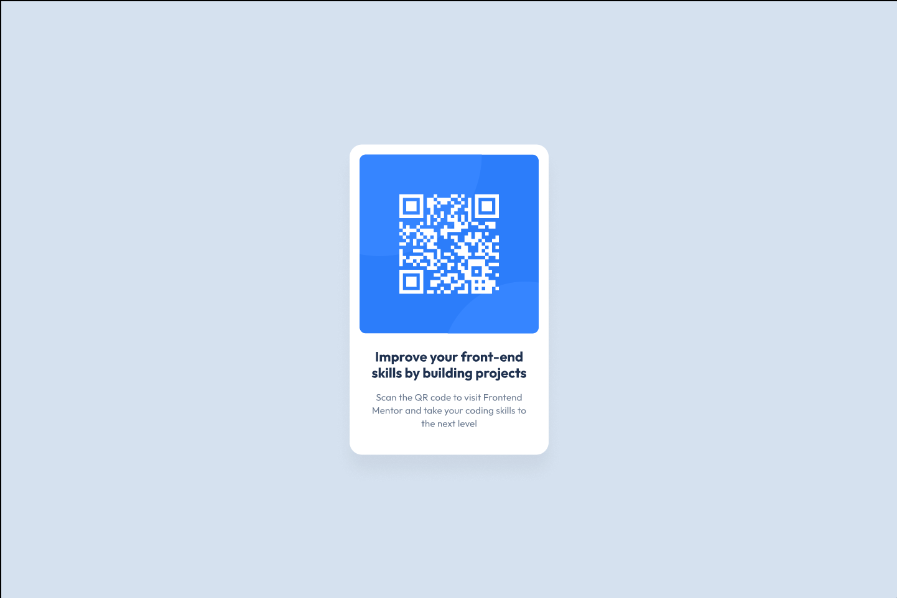

# Frontend Mentor - QR code component
## Welcome! 👋

Thanks for checking out my second mini project!
This is a solution to the [QR code component challenge](https://www.frontendmentor.io/challenges/qr-code-component-iux_sIO_H) on Frontend Mentor. Frontend Mentor challenges help you improve your coding skills by building realistic projects.

## Link to Netflify
    https://qr-main.netlify.app/

##Screenshot of my Final Project

